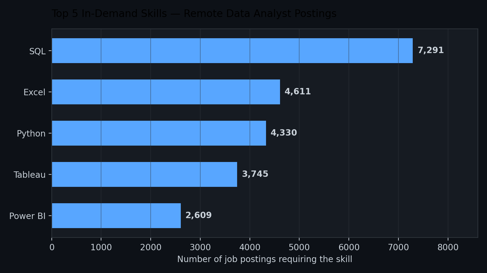
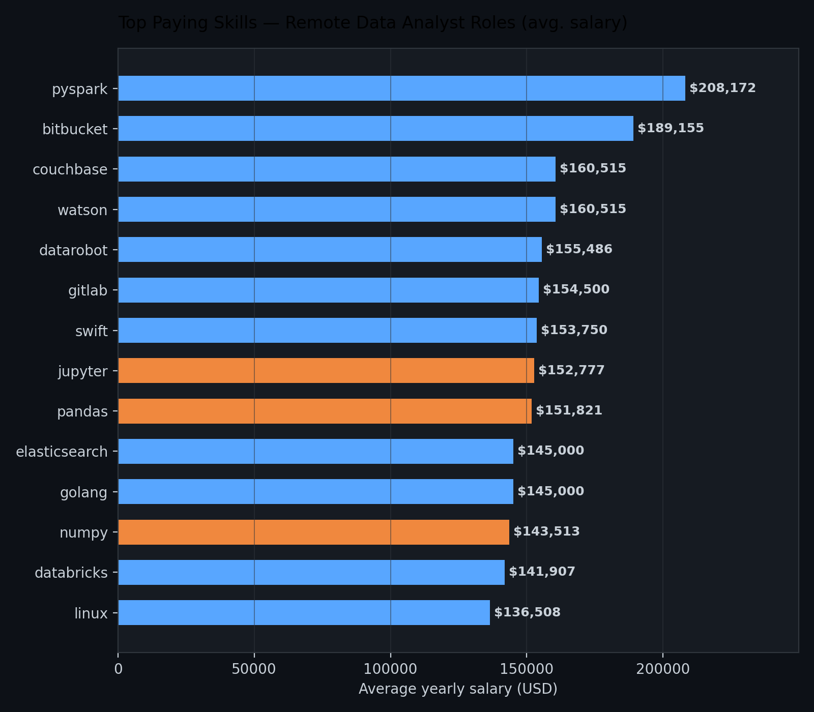

# 📊 Data Analyst Job Market Analysis (SQL)

## Introduction

This project dives into the 2023 data job market to answer a question every aspiring or current Data Analyst asks at some point: **what should I actually be learning to land a well-paid job?**

Using SQL, I explored real remote Data Analyst job postings to uncover the top-paying roles, the skills those roles demand, which skills show up most often across the market, and — most importantly — which skills strike the best balance between demand and salary.

Check out the SQL queries here: [project_sql folder](./project_sql)

---

## Background

Not every "Data Analyst" job posting is the same. Titles are consistent, but the actual skill requirements — and the salaries attached to them — vary a lot. Rather than guessing, this project pulls the data itself apart to find real patterns.

### The questions this project set out to answer:
1. What are the top-paying Data Analyst jobs?
2. What skills are required for those top-paying jobs?
3. What skills are most *in demand* for Data Analysts?
4. Which skills are associated with the highest salaries?
5. What are the most *optimal* skills to learn (high demand **and** high pay)?

---

## Tools I Used

- **SQL** — the core of the analysis: querying, joins, aggregations, CTEs
- **PostgreSQL** — database engine for hosting and running the job postings dataset
- **Visual Studio Code** — writing and running queries
- **Git & GitHub** — version control and sharing this project

---

## The Analysis

### 1. Top Paying Data Analyst Jobs
I started by filtering remote Data Analyst postings down to the 10 highest-paying roles with a specified salary. Salaries at the top end varied a lot between employers — a sign that the job title alone doesn't tell you what a role actually expects, or pays.

### 2. Skills for Top Paying Jobs
Next, I looked at exactly what those top 10 highest-paying jobs were asking for in terms of skills. **SQL** showed up in every single one of them, with **Python** and **Tableau** close behind — an early signal that the highest-paying roles still lean on the same core fundamentals.

### 3. Most In-Demand Skills
Rather than just the top payers, I looked at *every* remote Data Analyst posting to see which skills appeared most often — a good proxy for job security.

SQL dominates, appearing in nearly 60% more postings than the next closest skill (Excel), followed by Python, Tableau, and Power BI. This confirms SQL isn't a "nice to have" — it's the baseline expectation across almost every Data Analyst posting.

### 4. Top Paying Skills
Then I flipped the lens to look at which *individual* skills were tied to the highest average salaries, regardless of how often they appeared.

The highest-paying skills lean toward **big data and engineering-adjacent tech** (`pyspark`, `databricks`, `elasticsearch`) and **dev/deployment tooling** (`bitbucket`, `gitlab`), rather than classic analyst tools. Meanwhile, going deeper into Python's data-science stack (`pandas`, `numpy`, `jupyter`) also pays off noticeably. This suggests postings labeled "Data Analyst" that ask for engineering-flavored skills tend to be hybrid roles — and they pay a premium for that overlap.

### 5. Most Optimal Skills to Learn
Finally, I combined demand and salary into a single view — skills that are both frequently requested *and* well paid are the most strategic ones to prioritize. This turns two separate observations ("SQL is everywhere" and "PySpark pays well") into one prioritized list, balancing job security with earning potential rather than chasing a high salary on a rarely-requested skill.

---

## What I Learned

- **CTEs (`WITH` clauses)** are essential for breaking a complex question into readable, reusable pieces — especially when the same base query needs slightly different filters.
- **Qualifying column names** (`table.column`) isn't just good style — it's required the moment a column name exists in more than one joined table, otherwise you'll hit an "ambiguous column" error.
- **`INNER JOIN` silently returns zero rows** if either side of the join has no matching data — a completely valid, error-free result that can look like a bug when it's actually a data-loading issue.
- **Aggregations (`COUNT`, `AVG`, `ROUND`) + `GROUP BY`** turn raw job postings into real insights — demand counts and salary averages are only meaningful once you group by skill.

---

## Conclusion

1. **SQL is the entry ticket**, not a differentiator — it's in nearly every posting.
2. **Python + Tableau/Power BI** round out the core stack employers expect.
3. **Engineering-adjacent skills pay the most** — big data, cloud, and dev tooling beat "pure" analyst tools.
4. **Don't chase the highest-paying skill alone** — build outward from SQL and Python toward the high-value tools in the optimal-skills list.
